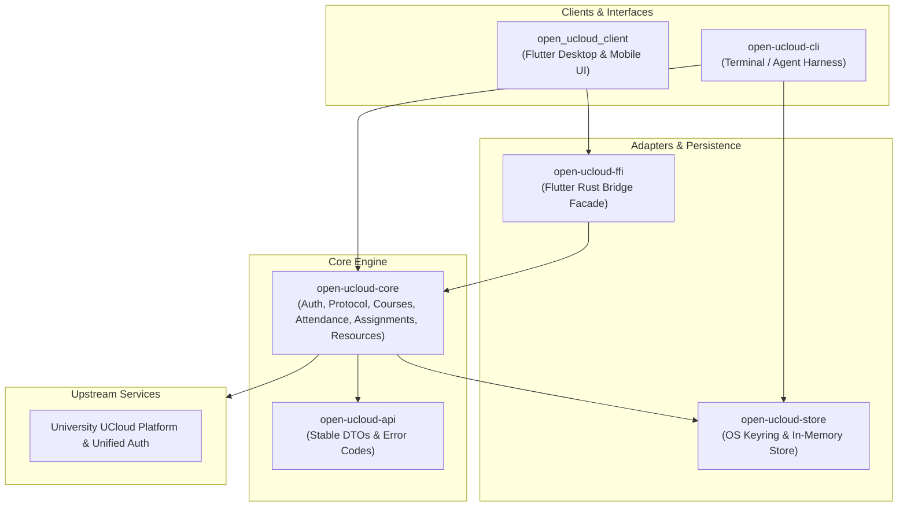

# Open UCloud

[](https://github.com/nizne9/open-ucloud/actions/workflows/ci.yml)
[](LICENSE)
[](https://www.rust-lang.org)
[]()
[](https://keepandroidopen.org/)

**Open UCloud** is a client-first, open-source personal client and agent-friendly CLI harness for university UCloud learning management platforms. It delivers a fast, privacy-preserving, and scriptable alternative to sluggish web interfaces, built with a high-performance **Rust** core and a multi-platform **Flutter** client.

---

## Table of Contents

- [Features](#features)
- [Architecture Overview](#architecture-overview)
- [Workspace Structure](#workspace-structure)
- [Quick Start](#quick-start)
  - [For End Users (Pre-built Binaries)](#for-end-users-pre-built-binaries)
  - [For Developers (Building from Source)](#for-developers-building-from-source)
- [CLI Reference & Usage](#cli-reference--usage)
  - [System Health & Diagnostics](#system-health--diagnostics)
  - [Authentication & Session](#authentication--session)
  - [Courses & Activity](#courses--activity)
  - [Attendance & Check-in](#attendance--check-in)
  - [Assignments & Submissions](#assignments--submissions)
  - [Course Resources & Downloads](#course-resources--downloads)
- [Platform & Credential Backends](#platform--credential-backends)
  - [Linux Credential Packages](#linux-credential-packages)
- [Security, Privacy & Ethics](#security-privacy--ethics)
- [Android Distribution Stance](#android-distribution-stance)
- [Development & Quality Gates](#development--quality-gates)
- [CI/CD & Releases](#cicd--releases)
- [Documentation Index](#documentation-index)
- [License](#license)

---

## Features

- 🎓 **Course Management**: Query enrolled courses, view course details, and monitor live in-progress class status (`going` vs. `idle`).
- 📍 **Attendance & Check-in**: Inspect real-time check-in activity, submit explicit check-ins, generate QR attendance parameters, and parse raw `checkwork|...` QR payloads.
- 📝 **Assignments & Submissions**: Filter assignments by course or keyword, track unfinished work, view grades and instructor feedback, upload attachments, and submit assignments with mandatory explicit confirmation (`--yes`).
- 📦 **Resource Downloads**: Stream course materials with directory creation, sanitized filenames, and guaranteed non-overwriting collision protection.
- 🔐 **Zero Plaintext Credentials**: Integrates with native operating system keychains and credential vaults (`keyring`). Tokens are automatically refreshed; no passwords, tokens, or cookies are ever stored in plaintext files.
- 🤖 **Agent-First & Scriptable CLI**: Verb-first command structure with stable, machine-readable JSON output (`--json`) designed for scripting and AI agents.
- 📱 **Cross-Platform Client**: High-performance Flutter GUI supporting Linux, Windows, macOS, and Android sharing the same Rust core via Flutter Rust Bridge.

---

## Architecture Overview

Open UCloud follows strict architectural boundaries: the Rust core owns business logic, authentication protocols, and upstream API interactions; the CLI provides an agent-friendly verification harness; and the Flutter application serves as the primary multi-platform user interface.



### Key Architectural Principles

1. **DTO-Oriented Boundary**: `crates/api` defines clean, stable Data Transfer Objects and error codes. Rust lifetimes, traits, generics, and internal session types are never exposed to FFI or CLI consumers.
2. **State Separation**: Presentation state remains strictly inside Flutter (Riverpod); business state and protocol lifecycle remain inside Rust core.
3. **No Plaintext Token Storage**: If the host platform's secure credential store is unavailable or locked, the application surfaces `SECURE_STORAGE_UNAVAILABLE` rather than falling back to unencrypted files.
4. **Unified File Operations**: Platform-native file picking is handled by `file_selector`, but attachment uploads and streaming downloads flow directly through the Rust core boundary. This ensures that download filename sanitization and non-overwriting collision-free allocation remain consistent between the CLI and GUI.

---

## Workspace Structure

The project is structured as a Cargo workspace with an accompanying Flutter client application:

| Path | Package | Description |
| --- | --- | --- |
| `crates/api` | `open-ucloud-api` | Public DTOs, session responses, and stable error codes. |
| `crates/core` | `open-ucloud-core` | Business logic, unified auth, token refresh, and protocol client. |
| `crates/store` | `open-ucloud-store` | OS credential-store integration (`keyring`) and in-memory test store. |
| `crates/cli` | `open-ucloud-cli` | Verb-first `open-ucloud` command-line interface. |
| `crates/ffi` | `open-ucloud-ffi` | Flutter Rust Bridge (FRB) bindings and Dart facade. |
| `apps/client` | `open_ucloud_client` | Flutter multi-platform client application (Linux, Android, Windows, macOS). |

---

## Quick Start

### For End Users (Pre-built Binaries)

Official release packages are published on [GitHub Releases](https://github.com/nizne9/open-ucloud/releases).

1. **CLI Users (Linux / Windows / macOS)**:
   - Download the release archive for your operating system and architecture.
   - Verify the checksum:
     ```bash
     sha256sum -c open-ucloud-linux-secret-service-x86_64.tar.gz.sha256
     ```
   - Extract the `open-ucloud` binary and place it in your `PATH`.
2. **Desktop Client Users**:
   - Download the client bundle for Linux, Windows, or macOS from the latest release.
3. **Android Users**:
   - Download the signed `.apk` matching your device ABI (typically `arm64-v8a`).
   - For installation instructions and verification guidance, see [docs/android-install.md](docs/android-install.md).

---

### For Developers (Building from Source)

#### Prerequisites

- **Rust**: Version 1.88 or newer (`rustup default stable`)
- **Flutter**: Version 3.11 or newer with Dart SDK
- **Build Tools**:
  - **Linux**: `clang`, `cmake`, `libgtk-3-dev`, `libsecret-1-dev`, `ninja-build`, `pkg-config`
  - **Windows**: Visual Studio C++ Build Tools with Desktop development with C++
  - **macOS**: Xcode Command Line Tools
  - **Android**: Android SDK, NDK, and Rust Android targets

---

#### 1. Building the CLI

```bash
# Check environment and system credential backend
cargo run -p open-ucloud-cli -- doctor

# Build release CLI binary
cargo build --release -p open-ucloud-cli
```

---

#### 2. Building the Desktop Client (Flutter + Rust FFI)

##### Linux Desktop

```bash
# 1. Install system development headers (Ubuntu/Debian)
sudo apt-get update && sudo apt-get install -y \
  clang cmake libgtk-3-dev libsecret-1-dev ninja-build pkg-config

# 2. Build the Rust FFI library
cargo build -p open-ucloud-ffi

# 3. Launch the Flutter client
cd apps/client
flutter pub get
flutter run -d linux
```

##### Windows Desktop

Windows builds must be run on a Windows host:

```powershell
# Build Rust FFI DLL
cargo build --release -p open-ucloud-ffi

# Build Windows executable
cd apps/client
flutter pub get
flutter build windows --release
```

##### macOS Desktop

macOS builds must be run on a macOS host:

```bash
# Build Rust FFI dylib
cargo build --release -p open-ucloud-ffi

# Build macOS app bundle
cd apps/client
flutter pub get
flutter build macos --release
```

---

#### 3. Building the Android Client

```bash
# 1. Add Android Rust targets
rustup target add aarch64-linux-android armv7-linux-androideabi x86_64-linux-android

# 2. Build debug APK
cd apps/client
flutter build apk --debug
```

> [!NOTE]
> Android release builds require a local signing keystore. Copy `apps/client/android/key.properties.example` to `apps/client/android/key.properties` and configure your credentials. Do not commit `key.properties`.

---

#### 4. Regenerating FFI Bindings

If you modify public functions in `crates/ffi`:

```bash
flutter_rust_bridge_codegen generate
```

---

## CLI Reference & Usage

The `open-ucloud` CLI follows a verb-first design. Add `--json` to any command for stable, machine-readable JSON output suitable for scripts and autonomous agents.

### System Health & Diagnostics

```bash
# Diagnose local CLI readiness and check OS credential backend status
open-ucloud doctor
open-ucloud doctor --json

# Inspect client capabilities (e.g. selfAttendance, qrParsing)
open-ucloud capabilities --json
```

### Authentication & Session

Open UCloud never accepts passwords as command-line arguments. Login is interactive and sessions are saved directly into the OS credential store:

```bash
# Interactive login (prompts securely for username & password)
open-ucloud login --interactive

# Inspect current session metadata (redacts tokens/cookies)
open-ucloud session --json

# Clear stored session credentials (requires explicit confirmation)
open-ucloud logout --yes
```

### Courses & Activity

```bash
# List all active student courses
open-ucloud courses
open-ucloud courses --json

# List courses including live in-progress attendance status (going vs. idle)
open-ucloud courses --with-going --json

# Inspect a single course by site ID
open-ucloud course <site-id> --json
```

### Attendance & Check-in

```bash
# Check current attendance status for a course (both forms supported)
open-ucloud attendance --site <site-id> --json
open-ucloud attendance status --site <site-id> --json

# Submit an explicit check-in (requires --yes confirmation)
open-ucloud attendance sign --site <site-id> --group <group-id> --yes --json

# Resolve parameters for rendering the in-progress attendance QR code
open-ucloud attendance qr --site <site-id> --group <group-id> --json
```

> [!NOTE]
> Core and FFI also support parsing raw user-supplied `checkwork|...` QR payload text for client adapters that support QR paste/scan flows.

### Assignments & Submissions

```bash
# List assignments for a course (with optional keyword filter)
open-ucloud assignments list --site <site-id> [--keyword <query>] --json

# View all pending/unfinished assignments across all courses
open-ucloud assignments undone --json

# View full assignment detail (instructions, deadlines, scores, submissions)
open-ucloud assignments detail <assignment-id> --json

# Upload an assignment attachment file (validates assignment status first)
open-ucloud assignments upload <assignment-id> --file <path> --yes --json

# Submit assignment with text and optional uploaded attachments
open-ucloud assignments submit <assignment-id> \
  --content "Assignment response text" \
  --attachment <resource-id> \
  --yes --json
```

> [!IMPORTANT]
> Uploading attachments and submitting assignments are live mutating operations. They require the explicit `--yes` flag to prevent accidental submission.

### Course Resources & Downloads

```bash
# List all course resources and files
open-ucloud resources list --site <site-id> --json

# View resource detail and obtain download URL
open-ucloud resources detail <resource-id> --site <site-id> --json

# Download a specific resource safely (never overwrites existing files)
open-ucloud resources download <resource-id> --site <site-id> --out-dir ./materials --json

# Download all resources for an entire course in batch
open-ucloud resources download-course --site <site-id> --out-dir ./materials --yes --json
```

---

## Platform & Credential Backends

Open UCloud uses native system credential stores to safeguard auth tokens. Plaintext file fallback is strictly disallowed.

| Platform | Credential Backend | Persistence | Diagnostic Backend Name |
| --- | --- | --- | --- |
| **Linux (CLI - Default)** | Linux Kernel `keyutils` | Until reboot | `keyutils` |
| **Linux (Desktop / Secret Service)** | FreeDesktop Secret Service (GNOME Keyring, KWallet) | Until deleted | `secret-service` |
| **Windows** | Windows Credential Manager | Until deleted | `credential-manager` |
| **macOS** | Apple Keychain Services | Until deleted | `keychain` |
| **Android** | Android Keystore / EncryptedSharedPreferences | Until app uninstalled | N/A (Client Secure Storage) |

### Linux Credential Packages

Linux distributions have two package variants depending on the runtime environment:

| Package Artifact | Build Feature Flag | Recommended Environment |
| --- | --- | --- |
| `open-ucloud-linux-keyutils` | *(Default)* | Headless servers, CI runners, and WSL |
| `open-ucloud-linux-secret-service` | `--features linux-secret-service` | Native Linux desktop environments with DBus |

The Secret Service artifact requires a DBus session and a provider such as GNOME Keyring, KWallet, or KeePassXC with an unlocked collection. Building it may also require `libdbus-1-dev` and `pkg-config`; use `--features linux-secret-service-vendored` only when the release environment intentionally needs vendored native dependencies.

Use `open-ucloud doctor` to confirm the actual `credential backend`, `credential persistence`, and runtime `credential status` of the binary being run. The runtime probe tests storage using a temporary `doctor-probe` credential entry, without touching or risking your stored login session.

---

## Security, Privacy & Ethics

- **Zero Plaintext Credentials**: Authentication tokens, refresh tokens, and cookies are never written to unencrypted disk files.
- **Strict Data Redaction**: Log files and standard CLI outputs automatically redact usernames, passwords, authorization tokens, and upstream cookies.
- **Write Safety Gates**: All mutating actions (`assignments upload`, `assignments submit`, `resources download-course`, `logout`) mandate explicit `--yes` confirmation.
- **Collision-Free File Downloads**: File download paths are sanitized and checked against directory traversal. If a file exists, a collision-free filename is allocated to prevent data loss.
- **Backup Exclusion**: Android manifests explicitly disable full application backups and cloud extraction to prevent sensitive session material from leaking across device transfers.
- **Ethical Usage**: Open UCloud is an open-source personal client for legitimate student access. It strictly prohibits and rejects automation designed to bypass institutional rules, forge attendance location/GPS data, generate automated test answers, or share account credentials.

---

## Android Distribution Stance

[](https://keepandroidopen.org/)

Android packages are published exclusively as release-signed APKs via [GitHub Releases](https://github.com/nizne9/open-ucloud/releases) and are not distributed through Google Play.

Open UCloud supports the open Android ecosystem and will not participate in Google's Android Developer Verification program, which mandates identity verification and signing-key escrow for third-party developers. The client embeds a vendored [FreeDroidWarn](https://github.com/woheller69/FreeDroidWarn) dialog (Apache-2.0) informing users of their software freedom rights.

For complete verification instructions and installation methods (direct sideloading, ADB, or de-Googled ROMs), please consult [docs/android-install.md](docs/android-install.md).

---

## Development & Quality Gates

All contributions must pass the project's verification gates prior to merge:

```bash
# Code formatting
cargo fmt --all
cd apps/client && dart format . && cd ../..

# Static analysis and linting
cargo clippy --workspace --all-targets
cd apps/client && flutter pub get && dart analyze && cd ../..

# Test suites
cargo test --workspace
cd apps/client && flutter test && cd ../..

# CLI smoke check
cargo run -p open-ucloud-cli -- --help
cargo run -p open-ucloud-cli -- doctor
```

For detailed quality expectations, MSRV specifications (Rust 1.88), and dependency auditing policies, see [docs/quality.md](docs/quality.md).

---

## CI/CD & Releases

Automated workflows on GitHub Actions maintain repository health:

- **`CI`**: Runs Rust formatting, Clippy, workspace tests, CLI smoke tests, Dart analysis, and Flutter widget tests on every PR and push to `main`.
- **`Build Artifacts`**: Generates temporary development test builds for CLI binaries and desktop bundles on `main`.
- **`Release`**: Triggered on `v*` tags. Publishes multi-architecture CLI packages, desktop application packages, release-signed Android APKs, and cryptographic `.sha256` checksums.

---

## Documentation Index

- [AGENTS.md](AGENTS.md): Repository rules, entry points, and coding guidelines.
- [docs/architecture.md](docs/architecture.md): Module boundaries, data flow, and dependency hierarchy.
- [docs/cli-contract.md](docs/cli-contract.md): Detailed CLI specifications, JSON contracts, and error code taxonomy.
- [docs/quality.md](docs/quality.md): Verification commands, MSRV policies, and structural requirements.
- [docs/android-install.md](docs/android-install.md): Android APK installation methods, sideloading, and SHA-256 verification.
- [docs/task-guidelines.md](docs/task-guidelines.md): Development workflow and pull request guidelines.

---

## License

This project is licensed under the [MIT License](LICENSE).
