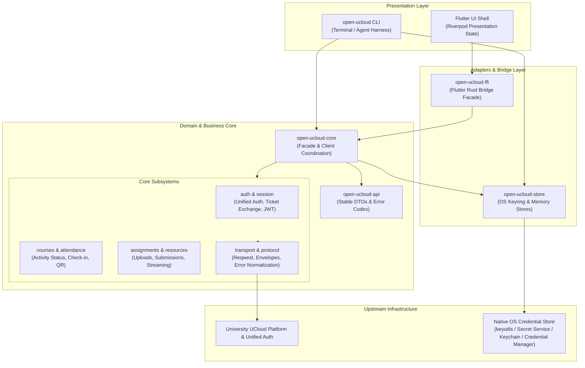

# System Architecture

Open UCloud is designed as a **client-first, multi-platform ecosystem** for interacting with university UCloud learning management systems. Rather than relying on fragile web scraping or heavyweight embedded browser runtimes, Open UCloud establishes a clean separation between high-performance business logic in Rust and modern reactive user interfaces in Flutter.

---

## 1. Architectural Philosophy

1. **Client-First & Rust-Anchored**: The core business logic, protocol handlers, authentication flows, and network transports reside entirely in the Rust core (`crates/core`). This core provides a durable, testable, and high-performance foundation.
2. **First Harness via CLI**: The command-line interface (`crates/cli`) serves as the first verification and integration surface, providing an agent-friendly, scriptable environment with stable contracts.
3. **Flutter as Primary UI**: Flutter (`apps/client`) provides a responsive, native multi-platform client across Linux, Android, Windows, and macOS, communicating with Rust through Flutter Rust Bridge (`crates/ffi`).
4. **Adapter-Only Extension**: Alternative clients (such as Web) are strictly downstream adapters. No presentation concerns or web-specific models may leak into the core.
5. **Strict DTO Boundaries**: Data crosses layer boundaries exclusively as Data Transfer Objects (DTOs) defined in `crates/api`. Rust lifetimes, traits, generics, and internal session types are never exposed to consumers.

---

## 2. High-Level Architecture Diagram

---

## 3. Monorepo Crate & Package Boundaries

The workspace enforces strict separation across crates:

| Package | Directory | Primary Role | Allowed Inward Dependencies | Forbidden Dependencies |
| --- | --- | --- | --- | --- |
| `open-ucloud-api` | `crates/api` | Stable DTOs, request/response models, and error codes. | None (pure data schemas) | `core`, `store`, `cli`, `ffi`, Flutter |
| `open-ucloud-core` | `crates/core` | Business operations, upstream protocol parsing, auth lifecycle. | `open-ucloud-api`, `open-ucloud-store` | `cli`, `ffi`, Flutter, UI concepts |
| `open-ucloud-store` | `crates/store` | Credential storage abstraction, keyring bindings, memory store. | None | `core`, `cli`, `ffi`, Flutter |
| `open-ucloud-cli` | `crates/cli` | Terminal CLI harness, argument parsing, JSON serialization. | `api`, `core`, `store` | `ffi`, Flutter |
| `open-ucloud-ffi` | `crates/ffi` | Flutter Rust Bridge facade for Dart integration. | `api`, `core`, `store` | `cli`, Flutter UI |
| `open_ucloud_client` | `apps/client` | Flutter desktop and mobile application. | `open-ucloud-ffi` (via generated Dart code) | Direct Rust crates |

---

## 4. Core Internal Boundaries (`crates/core`)

`crates/core/src/lib.rs` serves as a high-level facade. Implementation logic is divided into modular domain handlers:

- **`client.rs`**: Houses `OpenUcloudClient` and shared HTTP connection configurations.
- **`transport.rs`**: HTTP abstraction layer decoupling reqwest from business rules.
- **`protocol.rs`**: Parsing and validation of upstream JSON response envelopes, HTML documents, and type normalization.
- **`error.rs`**: Core error mapping ensuring all internal faults map to stable, actionable error codes defined in `open-ucloud-api`.
- **`auth.rs`**: Full authentication protocol: unified SSO page scraping, optional captcha fetching, credential dispatch, ticket extraction, token exchange, role resolution, and JWT decoding.
- **`session.rs`**: Session lifecycle management, coordinating automatic token refresh, expiry calculation, and store synchronization.
- **`courses.rs`**: Course roster retrieval, course detail resolution, and defensive pagination handling.
- **`attendance.rs`**: Course activity polling, user check-in submission, attendance QR parameter resolution, and standalone parsing of raw `checkwork|...` QR payloads.
- **`assignments.rs`**: Course assignments querying, pending assignment aggregation, assignment detail loading, RFC 7578 multipart attachment uploading, and submission dispatch.
- **`resources.rs`**: Course material tree flattening, detail retrieval, download link generation, streamed file downloads, and path collision prevention.
- **`extensions.rs`**: Public capability defaults (e.g., `selfAttendance`, `attendanceQrPayloadParsing`) exposed to clients.

---

## 5. Cross-Cutting Design Protocols

### 5.1. Authentication & Token Lifecycle

1. **Unified Auth Chain**: The authentication flow simulates standard web SSO: initializes the unified login page, parses DOM inputs defensively, loads captcha images when required, submits credentials, extracts redirect tickets, and exchanges them for platform JWT bearer tokens.
2. **Single-Flight Concurrency Control**: In multi-threaded desktop or mobile environments, concurrent requests requiring token refresh are synchronized inside the Rust core. Only a single refresh chain executes per principal; simultaneous callers await the outcome and reuse the renewed credentials.
3. **Zero Plaintext Fallback**: Session tokens are persisted exclusively using the OS credential store (`crates/store`). If the OS keychain is locked or unavailable, the operation errors out with `SECURE_STORAGE_UNAVAILABLE` rather than storing unencrypted secrets on disk.

### 5.2. Attendance & QR Processing

- **Attendance Polling**: Evaluates current course activity states to flag courses as `going` (active check-in open) or `idle`.
- **Check-in Execution**: Submits explicit user-approved sign-ins.
- **QR Parameter Generation**: Computes parameters (`attendanceId`, `createTime`, `groupId`) required to render in-progress attendance QR codes.
- **Raw QR Parsing**: Provides pure, offline text parsing for `checkwork|...` QR payload formats for adapters supporting paste or camera scan workflows.

### 5.3. File Operations & Download Safety

- **Path Traversal Protection**: All upstream file names are stripped of unsafe characters and path separators.
- **Collision-Free Allocation**: When downloading materials (`resources download` or `download-course`), existing local files are never overwritten. A numeric suffix (`filename (1).ext`) is automatically allocated.
- **Streaming Pipeline**: Files stream directly from HTTP response to filesystem, minimizing memory footprints.
- **RFC 7578 Compliance**: Assignment attachment uploads use standard `multipart/form-data` with single UTF-8 `filename` headers. Unsafe characters (such as CR/LF) are rejected prior to request transmission.

### 5.4. Flutter & FFI State Coordination

- **Riverpod State Flow**: Presentation state in Flutter is immutable (`client_state.dart`) and driven by controllers (`client_controller.dart`).
- **Ephemeral Password Handling**: User passwords are held in memory solely for the duration of the authentication flow and are zeroed immediately upon completion, error, or provider disposal.
- **Opaque Session Tokens**: Dart handles session tokens as opaque byte buffers, passing them into the Rust FFI facade without inspecting or altering internal crypto structures.

---

## 6. Architectural Invariants

- **Unidirectional Dependency**: Dependencies flow strictly inward toward `crates/api` and `crates/core`. Core never imports from CLI, FFI, or Flutter.
- **Redaction by Default**: No user passwords, authentication tokens, refresh tokens, or raw cookie headers may appear in log outputs, CLI standard output, or unencrypted storage.
- **Write Safety Gates**: All mutating actions (`upload`, `submit`, `download-course`, `logout`) mandate explicit `--yes` confirmation in automated environments.
- **Bounded Pagination**: Upstream pagination defensively limits query loops, deduplicates records by stable ID, and reports explicit errors if hard page boundaries are exceeded.
