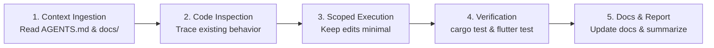

# Task & Contribution Guidelines

This document outlines the workflow, scoping principles, commit conventions, and reporting requirements for human contributors and autonomous AI agents working in Open UCloud.

---

## 1. Task Scoping & Shape

Tasks should be scoped narrowly enough to be completed, verified, and reported in a single, focused pass. Every non-trivial task must establish four boundaries:

1. **Goal**: The explicit user-visible capability or internal engineering outcome being delivered.
2. **Scope**: The specific packages, crates, or files permitted to change.
3. **Non-Goals**: Explicit boundaries and temptations to avoid (e.g., refactoring unrelated modules, adding speculative abstractions).
4. **Verification Gates**: Concrete commands and automated checks that must pass before the task is declared complete.

---

## 2. Developer & Agent Workflow



1. **Ingest Project Context**: Read `AGENTS.md` and relevant technical guides in `docs/` before making changes.
2. **Inspect Before Modifying**: Trace existing code paths, tests, and error mappings before introducing new logic.
3. **Respect Invariants**: Maintain module boundaries. Core logic belongs in `crates/core`; DTOs belong in `crates/api`; presentation state belongs in Flutter.
4. **Verify Mechanically**: Always run automated tests and linters (`cargo clippy`, `cargo test`, `flutter test`). Avoid manual assumptions where mechanical checks exist.
5. **Durable Documentation**: If a task introduces, modifies, or deprecates commands, DTO fields, or architecture boundaries, update `README.md` and the appropriate file in `docs/`. Never store durable project design decisions solely in chat threads or temporary notes.

---

## 3. Commit Message Conventions

Commit messages must follow concise, conventional commit standards:

```text
<type>(<scope>): <short imperative description>
```

- **Types**:
  - `feat`: A new feature or capability.
  - `fix`: A bug fix or error handling correction.
  - `refactor`: Code reorganization with no observable behavior changes.
  - `docs`: Documentation updates, README additions, or spec clarifications.
  - `chore`: Toolchain, dependency, or CI/CD workflow adjustments.
  - `test`: Adding or updating test suites.
- **Examples**:
  - `feat(core): add attendance QR payload parsing`
  - `fix(cli): handle locked credential keyring gracefully`
  - `docs: rewrite architecture and quality documentation`
  - `chore: bump dependencies for Rust 1.88 MSRV`

---

## 4. Completion Report Template

Upon completing any development task or bug fix, provide a structured completion report covering:

```markdown
### Summary of Changes
- High-level overview of what was implemented or resolved.

### Modified Files
- `crates/.../file.rs`: Description of changes.
- `apps/client/.../file.dart`: Description of changes.

### Verification Performed
- `cargo fmt --all` (Passed)
- `cargo clippy --workspace --all-targets` (Passed)
- `cargo test --workspace` (Passed)
- `flutter test` (Passed)

### Open Follow-ups or Gaps
- Any noted deferred items or non-blocking technical debt.
```

---

## 5. Architectural Escalation

If during implementation a task uncovers architectural drift, boundary ambiguity, or an undocumented recurring pattern:
1. Stop and surface the discrepancy.
2. Update `docs/architecture.md`, `docs/cli-contract.md`, or `docs/quality.md` to reflect the approved resolution.
3. Do not rely on unwritten conventions.
